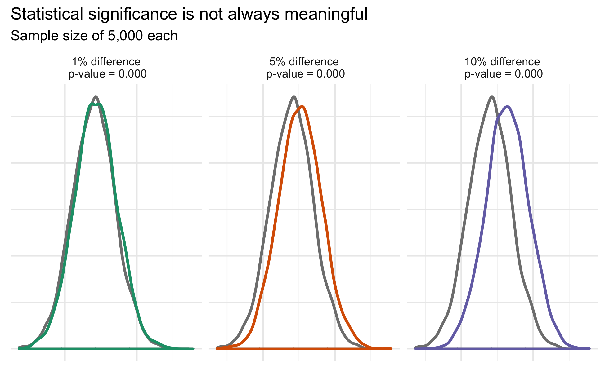
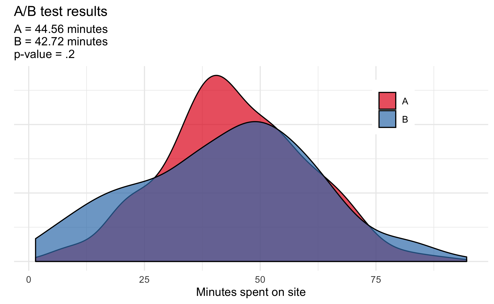

```{r setup, include=FALSE, fig.height= 4, fig.width= 6}
knitr::opts_chunk$set(echo = FALSE)
library(knitr)

```

A/B testing has become a buzz-word across the tech landscape. The method allows decision makers to see which version of a product performs better and enables leaders to make evidence-informed decisions. Companies, political campaigns, and market research firms, often utilize these tests to improve website design, products, and marketing strategies. 

You’re probably already doing A/B testing, but you could be doing it wrong. There are four common errors that undermine the results of your test and lead to bad decisions:

* Optional Stopping: running the same test until you see a positive result.
* Multiple Comparisons: if there is a negative result, try a different outcome.
* Insignificant “Significant” Results: ignoring effect size.
* Ignoring Interactions: randomization is not always enough. 

## Optional stopping

One choice during the A/B process is deciding when data collection should stop and testing should begin. Making quick decisions is valuable, and it is tempting to frequently test the results as data comes in. For instance, you could stop data collection after every 100 users and conduct your analysis; if there is no significant finding, you resume data collection and repeat the process.

This is a problem. Following A/B test theory, there is a 5% chance that a positive result is a false positive. Increasing the number of stops increases this chance of a false positive. 

To illustrate this problem, let’s conduct a series of simulations with a varying number of stops. The data were simulated such that there is no true difference between version A and version B, so any positive result is a false positive:

* Results show that stopping five times increases the false positive rate to about 15%, whereas stopping as many as 20 times increases the false positive rate to about 25%. 
* Frequent stopping can seem like a way to deliver quick results, but it drastically increases the risk of reaching a false conclusion. 


```{r, echo=FALSE, fig.align='center', out.width='80%'}

```


## The Multiple Comparison Problem

A single A/B test cycle can be used to answer many questions:

* Was there a difference in time spent between version A and version B?
* How about a difference in the number of clicks or likes? 

Testing multiple outcomes allows you to get the most out of a single cycle, but careful considerations need to be taken to avoid drastically increasing the false positive rate. This risk increases with each additional outcome and without implementing the correct adjustment, the probability of coming to a false conclusion substantially rises. 
 
> * To calculate the increase in risk of a false positive result, there is a simple formula based on the number of hypotheses you are testing (c) at a significance level of 0.05:

> * Probability of at least one false positive = $1 - (1 - 0.05)^c$

> * Example: 5 tests = 1-(1-0.05)^5  = 23% chance of a false positive.

The risk of multiple comparisons can be controlled by introducing the Bonferroni correction ^[https://www.stat.berkeley.edu/~mgoldman/Section0402.pdf], which accounts for the additional false positive risk introduced with each additional outcome. 

To illustrate the implications of uncontrolled multiple comparison, let's conduct another series of simulations, but this time replace varying stops with varying numbers of comparisons. Like before, there is no difference between version A and version B, and any positive result is a false positive. 


The plot below shows the increase in false positives as the number of comparisons increases:

* With as few as five comparisons, the risk of observing at least one false positive has increased from 5% to 20%
* However, when the appropriate correction is implemented, the false positive rate is held constant at 5%


```{r, echo=FALSE, fig.align='center', out.width='80%'}

```


## Insignificant “Significant” Results

Let’s say you ran your A/B test and achieved statistically significant results. You may think your work is done, but it’s important to consider the meaning of the effect size that you’re measuring, and its implications.

The below examples visualize different effect sizes that all have statistically significant results (p-values < 0.05). You can clearly see that although all effect sizes are statistically significant, they each can have different meanings (a 10% change could have a much larger impact on your company than 1%).


```{r, echo=FALSE, fig.align='center', out.width='80%'}

```

Now, if the true difference between both versions was one second spent on the website, is this meaningful enough to your team? Will it translate it into higher revenue that can justify rolling out this new version? Sometimes implementing a new version of a product can be costly, so it’s imperative to review whether or not it’s worth it. You should think not only of statistical significance, but the effect size.  


### Large sample, small effect

Incredibly small effects reach statistical significance as sample size grows. If you usually work with large sample sizes, a statistically significant result many not necessarily signal a meaningful change.


```{r, echo=FALSE, fig.align='center', out.width='80%'}

```


## Ignoring Interactions

The power of randomization is that it allows you to make causal conclusions. However, randomization is not enough to uncover hidden patterns within your test. 

For example, imagine you were a digital news organization interested in comparing the effects of how changing your website impacts how many minutes users spend reading site content. You know that some readers use their computers while others primarily use their phones to visit the site. 

You conduct your A/B test and use randomization to ensure an equal number of computer and mobile users received version A and version B. If you stopped here and conducted your analysis, you would conclude that there is no difference between version A and version B of the site. 

This simple A/B test does not account for the possibility that the effect of version A and version B may differ between computer and mobile users


```{r, echo=FALSE, fig.align='center', out.width='80%'}

```


When you examine the potential interaction between mediums (either computer or mobile), important differences emerge and a real difference becomes apparent. Among computer users, version B decreases time spent on the site, however, the same version increases time spent for users primarily interacting with the site by their phones. Without carefully exploring your data, underlying patterns can be lost.


```{r, echo=FALSE, fig.align='center', out.width='80%'}

```


## Conclusion

A/B testing is a powerful tool that is frequently praised for its simplicity and ease of analysis. However, misguided conclusions can be made when optional stopping, multiple comparisons, effect size, and possible interactions are ignored. 

When unaccounted for: 

* Frequently checking your data mid experiment (optional stoppage) and conducting multiple comparisons without correction drastically increases the rate of false positives. 

* Statistical significance and meaningful difference are not the same.

* Randomization alone is not enough to uncover hidden interactions within A/B tests.

Executing your experiment properly requires being mindful of these four common errors. If you are not, the results of your A/B test may be invalid and lead to poor decision-making.


